<!--
  brhn-me / README.md
  Curated GitHub profile landing page for github.com/brhn-me.
  Generated from app/about/profile.ts and app/projects/data/*.mdx in
  the brhn.me workspace.

  All dynamic visuals are committed in-repo:
  - assets/header-*.svg, taglines-*.svg, cards/*.svg, footer-*.svg are
    hand-authored animated SVGs (SMIL).
  - assets/stats-*.svg and langs-*.svg are regenerated daily by
    .github/workflows/profile-assets.yml.
  - The "Latest writing" list below is filled hourly by
    .github/workflows/blog-post-workflow.yml.
  Every image ships dark + light variants via <picture> tags.
-->

  <a href="https://www.brhn.me">
    <picture>
      <source media="(prefers-color-scheme: dark)" srcset="assets/header-dark.svg" />
      
    </picture>
  </a>

  
  
  

  <picture>
    <source media="(prefers-color-scheme: dark)" srcset="assets/taglines-dark.svg" />
    
  </picture>

I work across **AI and full-stack software engineering**, with a current focus on **agentic AI systems**. My day-to-day toolkit spans Java / Spring Boot microservices, Elasticsearch and large-scale data pipelines, applied ML and NLP, and cross-platform clients (web, desktop, WebAssembly). The code here ranges from production-grade backend services to weekend research experiments; longer write-ups live on [brhn.me](https://www.brhn.me).

---

### 🛠 What I work with

<table>
  <tr>
    <td><b>Languages</b></td>
    <td>
      <picture>
        <source media="(prefers-color-scheme: dark)" srcset="https://skillicons.dev/icons?i=java,python,go,ts,rust,bash&theme=dark" />
        
      </picture>
    </td>
  </tr>
  <tr>
    <td><b>AI / ML</b></td>
    <td>
      <picture>
        <source media="(prefers-color-scheme: dark)" srcset="https://skillicons.dev/icons?i=pytorch,opencv,fastapi&theme=dark" />
        
      </picture>
    </td>
  </tr>
  <tr>
    <td><b>Backend &amp; distributed</b></td>
    <td>
      <picture>
        <source media="(prefers-color-scheme: dark)" srcset="https://skillicons.dev/icons?i=spring,hibernate,kafka,redis,grafana,prometheus&theme=dark" />
        
      </picture>
    </td>
  </tr>
  <tr>
    <td><b>Frontend &amp; cross-platform</b></td>
    <td>
      <picture>
        <source media="(prefers-color-scheme: dark)" srcset="https://skillicons.dev/icons?i=react,nextjs,tauri,wasm,tailwind&theme=dark" />
        
      </picture>
    </td>
  </tr>
  <tr>
    <td><b>Data &amp; search</b></td>
    <td>
      <picture>
        <source media="(prefers-color-scheme: dark)" srcset="https://skillicons.dev/icons?i=elasticsearch,postgres,mongodb&theme=dark" />
        
      </picture>
    </td>
  </tr>
  <tr>
    <td><b>Infra &amp; tooling</b></td>
    <td>
      <picture>
        <source media="(prefers-color-scheme: dark)" srcset="https://skillicons.dev/icons?i=docker,aws,linux,git&theme=dark" />
        
      </picture>
    </td>
  </tr>
</table>

<em>Current focus: agentic AI systems — LLM agents, RAG, vector search, edge inference.</em>

---

### 🧭 Selected projects

<table>
  <tr>
    <td width="33%" align="center" valign="top">
      <a href="https://www.brhn.me/projects/fotu">
        <picture>
          <source media="(prefers-color-scheme: dark)" srcset="assets/cards/fotu-dark.svg" />
          
        </picture>
      </a>
      

        <a href="https://github.com/brhn-me/fotu">→ Code</a> · <a href="https://www.brhn.me/projects/fotu">→ Details</a>
      

    </td>
    <td width="33%" align="center" valign="top">
      <a href="https://www.brhn.me/projects/likhon">
        <picture>
          <source media="(prefers-color-scheme: dark)" srcset="assets/cards/likhon-dark.svg" />
          
        </picture>
      </a>
      

        <a href="https://github.com/brhn-me/likhon">→ Code</a> · <a href="https://www.brhn.me/projects/likhon">→ Details</a>
      

    </td>
    <td width="33%" align="center" valign="top">
      <a href="https://www.brhn.me/projects/pipilika">
        <picture>
          <source media="(prefers-color-scheme: dark)" srcset="assets/cards/pipilika-dark.svg" />
          
        </picture>
      </a>
      

        <a href="https://www.brhn.me/projects/pipilika">→ Details</a>
      

    </td>
  </tr>
</table>

More on [brhn.me/projects →](https://www.brhn.me/projects)

---

### ✍️ Latest writing

<!-- BLOG-POST-LIST:START -->- **[Embracing Vim: The Unsung Hero of Code Editors](https://www.brhn.me/blog/vim)** · Apr 9, 2024
- **[Spaces vs. Tabs: The Indentation Debate Continues](https://www.brhn.me/blog/spaces-vs-tabs)** · Apr 8, 2024
- **[The Power of Static Typing in Programming](https://www.brhn.me/blog/static-typing)** · Apr 7, 2024
- **[ডিম পাড়ে হাঁসে, খায় বাগডাশে](https://brhnme.medium.com/%E0%A6%A1%E0%A6%BF%E0%A6%AE-%E0%A6%AA%E0%A6%BE%E0%A7%9C%E0%A7%87-%E0%A6%B9%E0%A6%BE%E0%A6%81%E0%A6%B8%E0%A7%87-%E0%A6%96%E0%A6%BE%E0%A7%9F-%E0%A6%AC%E0%A6%BE%E0%A6%97%E0%A6%A1%E0%A6%BE%E0%A6%B6%E0%A7%87-b27df5649381?source=rss-867d3ab0366f------2)** · Nov 27, 2023
- **[LLM and Bangla experiment with ChatGPT4](https://brhnme.medium.com/llm-and-bangla-experiment-with-chatgpt4-4667a0918cc5?source=rss-867d3ab0366f------2)** · Nov 14, 2023
<!-- BLOG-POST-LIST:END -->

Full archive on [brhn.me/posts →](https://www.brhn.me/posts)

---

### 📊 Activity

  <picture>
    <source media="(prefers-color-scheme: dark)" srcset="assets/stats-dark.svg" />
    
  </picture>
  <picture>
    <source media="(prefers-color-scheme: dark)" srcset="assets/langs-dark.svg" />
    
  </picture>

---

  
    <a href="https://www.brhn.me">brhn.me</a> &nbsp;·&nbsp;
    <a href="https://linkedin.com/in/brhn-me">linkedin</a> &nbsp;·&nbsp;
    <a href="https://www.brhn.me/posts">writing</a> &nbsp;·&nbsp;
    <a href="https://www.brhn.me/projects">projects</a>
  

  <picture>
    <source media="(prefers-color-scheme: dark)" srcset="assets/footer-dark.svg" />
    
  </picture>

